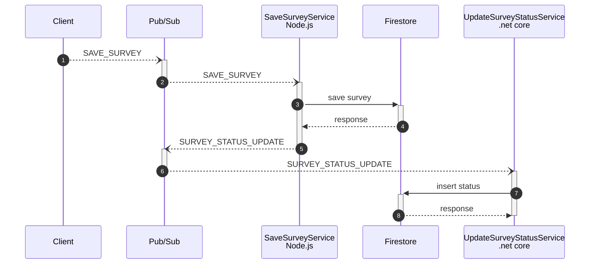

```mermaid
sequenceDiagram
    autonumber
    participant C as Client
    participant PS as Pub/Sub
    participant SSS as SaveSurveyService<br>Node.js
    participant FS as Firestore
    participant USSS as UpdateSurveyStatusService<br>.net core
    C--)+PS: SAVE_SURVEY
    PS--)SSS: SAVE_SURVEY
    deactivate PS
    activate SSS
    SSS->>+FS: save survey
    FS-->>-SSS: response
    SSS--)-PS: SURVEY_STATUS_UPDATE
    activate PS
    PS--)USSS: SURVEY_STATUS_UPDATE
    deactivate PS
    activate USSS
    USSS->>+FS: insert status
    FS-->>USSS: response
    deactivate FS
    deactivate USSS
```