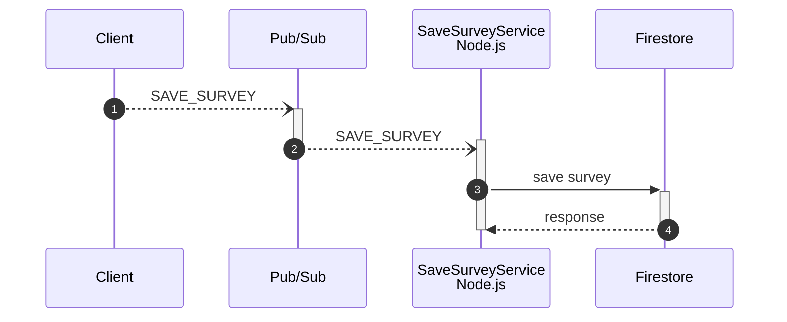

```mermaid
sequenceDiagram
    autonumber
    participant C as Client
    participant PS as Pub/Sub
    participant SSS as SaveSurveyService<br>Node.js
    participant FS as Firestore
    C--)+PS: SAVE_SURVEY    
    PS--)+SSS: SAVE_SURVEY
    deactivate PS    
    SSS->>+FS: save survey    
    FS-->>-SSS: response    
    deactivate SSS
```