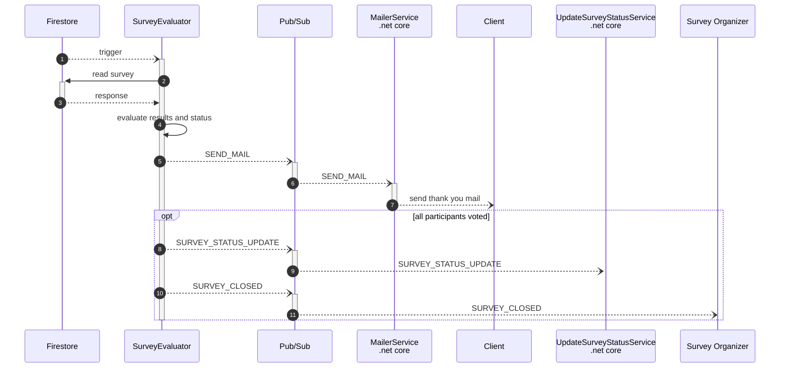

```mermaid
sequenceDiagram
    autonumber
    participant FS as Firestore
    participant SE as SurveyEvaluator 
    participant PS as Pub/Sub
    participant MS as MailerService<br>.net core
    participant C as Client
    participant USS as UpdateSurveyStatusService<br>.net core
    participant SO as Survey Organizer
    FS--)+SE: trigger
    SE->>+FS: read survey
    FS-->>-SE: response
    SE->>SE: evaluate results and status  
    SE--)+PS: SEND_MAIL
    PS--)+MS: SEND_MAIL
    deactivate PS
    MS--)C: send thank you mail
    deactivate MS
    opt all participants voted
        SE--)+PS: SURVEY_STATUS_UPDATE
        PS--)+USS: SURVEY_STATUS_UPDATE
        deactivate PS
        SE--)+PS: SURVEY_CLOSED
        PS--)-SO: SURVEY_CLOSED
    end
    deactivate SE
```