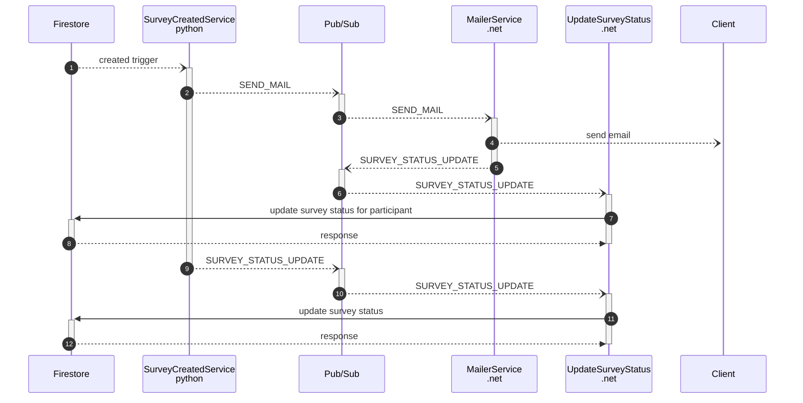

```mermaid
sequenceDiagram
    autonumber
    participant FS as Firestore
    participant SCS as SurveyCreatedService<br>python
    participant PS as Pub/Sub
    participant MS as MailerService<br>.net
    participant USS as UpdateSurveyStatus<br>.net
    participant C as Client
    FS--)+SCS: created trigger
    SCS--)+PS: SEND_MAIL
    PS--)+MS: SEND_MAIL
    deactivate PS
    MS--)+C: send email
    MS--)+PS: SURVEY_STATUS_UPDATE
    deactivate MS
    PS--)+USS: SURVEY_STATUS_UPDATE
    deactivate PS    
    USS->>+FS: update survey status for participant
    FS-->>-USS: response
    deactivate USS
    SCS--)+PS: SURVEY_STATUS_UPDATE
    deactivate SCS
    PS--)+USS: SURVEY_STATUS_UPDATE
    deactivate PS
    USS->>+FS: update survey status
    FS-->>-USS: response
    deactivate USS
```