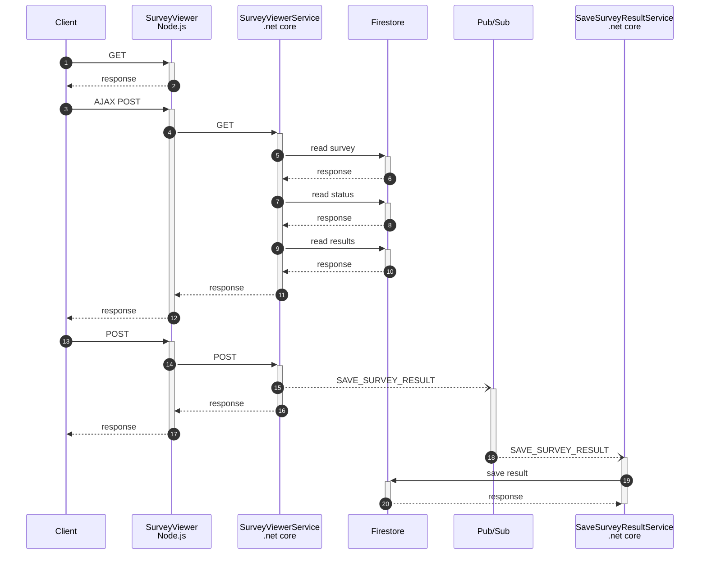

```mermaid
sequenceDiagram
    autonumber
    participant C as Client
    participant SV as SurveyViewer<br>Node.js
    participant SVS as SurveyViewerService<br>.net core
    participant FS as Firestore
    participant PS as Pub/Sub
    participant SSRS as SaveSurveyResultService<br>.net core
    %% GET
    C->>+SV: GET
    SV-->>-C: response
    C->>+SV: AJAX POST
    SV->>+SVS: GET
    SVS->>+FS: read survey
    FS-->>-SVS: response
    SVS->>+FS: read status
    FS-->>-SVS: response
    SVS->>+FS: read results
    FS-->>-SVS: response
    SVS-->>-SV: response
    SV-->>-C: response
    %% POST
    C->>+SV: POST
    SV->>+SVS: POST
    SVS--)+PS: SAVE_SURVEY_RESULT
    SVS-->>-SV: response
    SV-->>-C: response
    PS--)SSRS: SAVE_SURVEY_RESULT
    deactivate PS
    activate SSRS
    SSRS->>+FS: save result
    FS-->>-SSRS: response
    deactivate SSRS
```