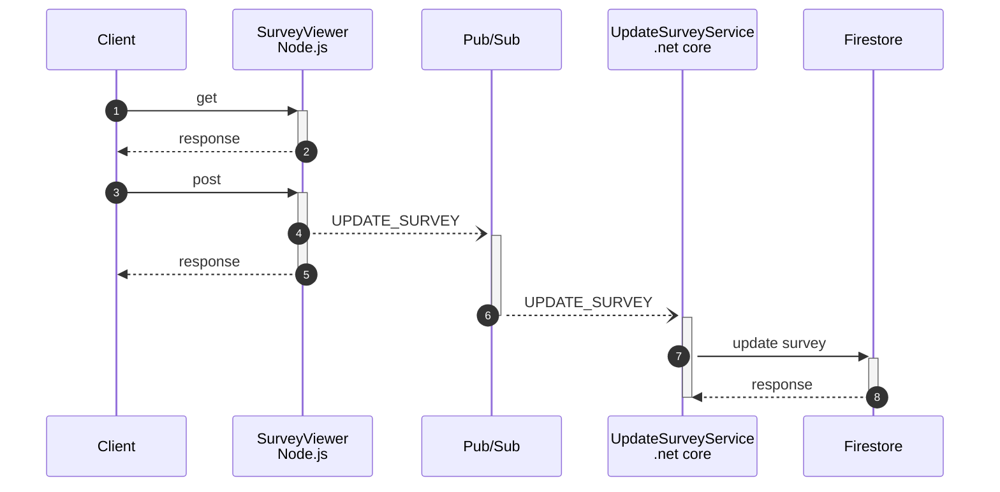

```mermaid
sequenceDiagram
    autonumber
    participant C as Client
    participant SV as SurveyViewer<br>Node.js
    participant PS as Pub/Sub
    participant US as UpdateSurveyService<br>.net core
    participant FS as Firestore
    C->>+SV: get
    SV-->>-C: response    
    C->>+SV: post
    SV--)+PS: UPDATE_SURVEY
    activate PS
    SV-->>-C: response
    PS--)+US: UPDATE_SURVEY
    deactivate PS
    activate US
    US->>+FS: update survey
    FS-->>-US: response
    deactivate US

```